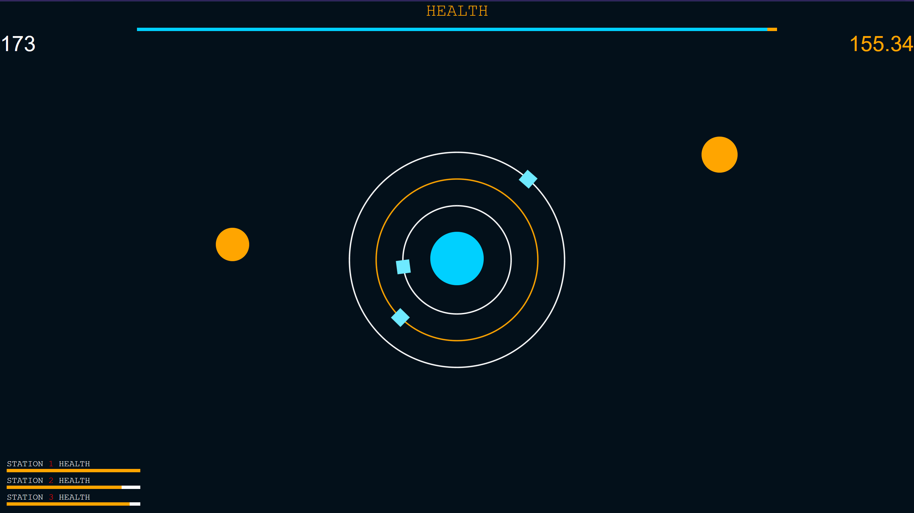

# Orbital
A game I initially made at a hackathon in 2015. Parts have been added on to make the game more playable. Available to play here: https://fiskhe.github.io/orbital/
## Looks a bit like this:

# Instructions:

## Objective
Keep the asteroids from hitting your home planet (blue circle in the center) at all costs. Use the space stations to intercept the incoming asteroids. 

## Controls:
- Use left and right arrow keys to rotate the selected space station counter-clockwise or clockwise, respectively.
- Press 1, 2, or 3 to switch between the three stations.

